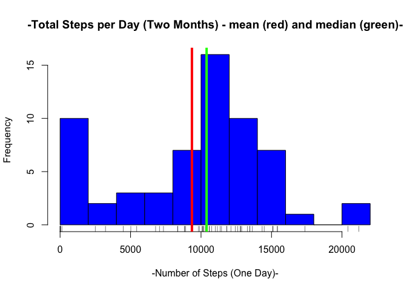
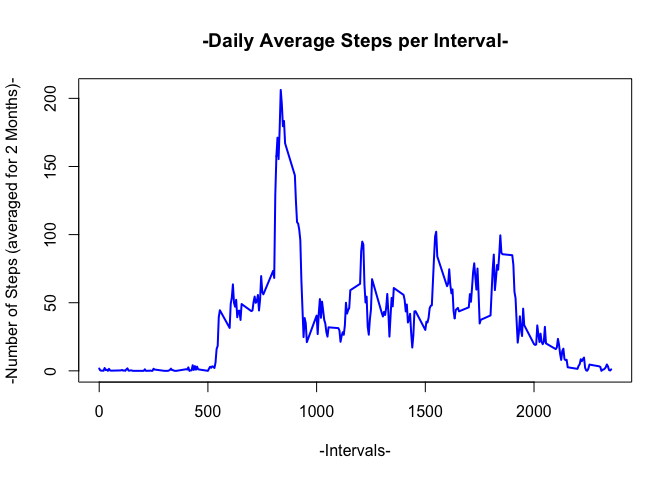
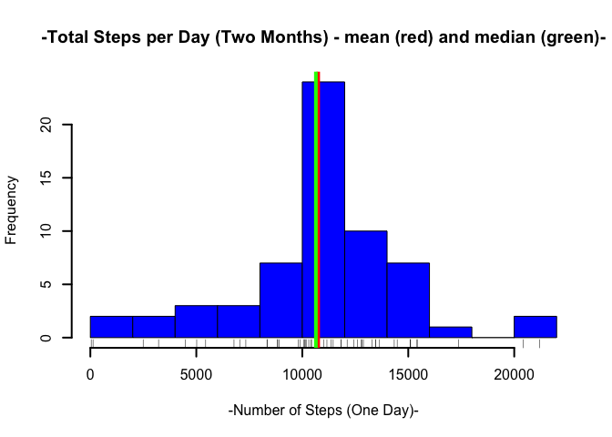
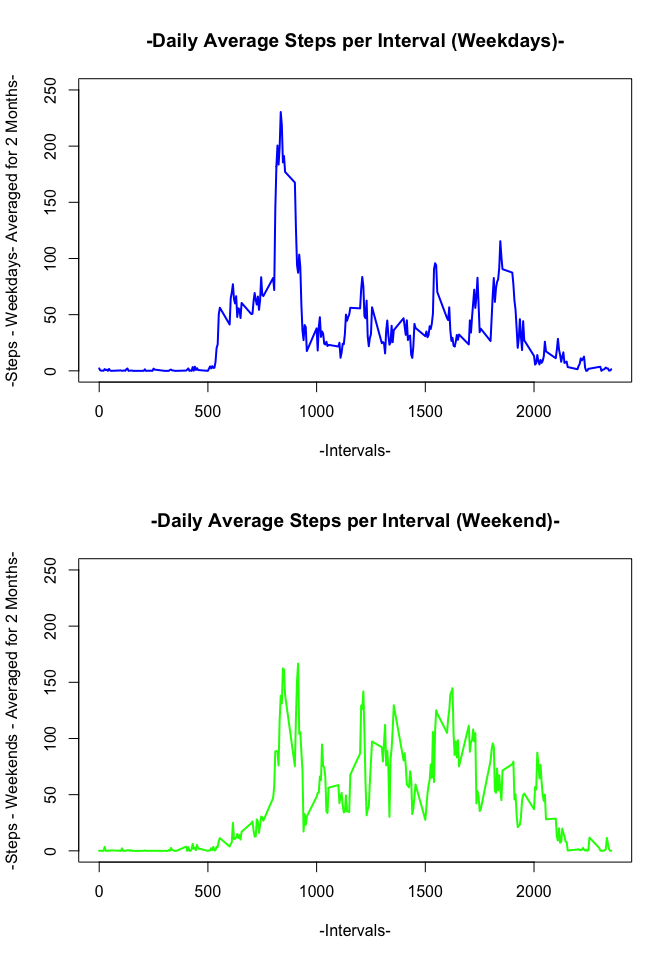

# Reproducible Research: Peer Assessment 1

## Loading and preprocessing the data

```r
########################################################################
## Comment on the report contents
########################################################################
## Since the assignment is not totally clear about what is the "report" and what
## is "the submission"
## (the .md or (.md + .Rmd) ?) I have made the choice to limit the amount of code 
## displayed in the .md file in order to keep it readable for a reader only
## interested in key results (I guess it would be the purpose in real business).
## 
## I included code in .md document only for the loading and preprocessing data section
## and for the strategy for imputing NA value.
## The rest of the .md is only plots and text to answer questions.
##
## Of course, all code is provided in the .Rmd file in order to be reproduced
## (most chuncks have echo=FALSE to be removed to get everything in the .md).
##
########################################################################
##
FIBIT_DATA<-read.csv("./activity.csv", sep=",", header= TRUE, na.strings=c("NA"),
                     colClasses=c("numeric","character","numeric"))
library(dplyr)
```

```
## 
## Attaching package: 'dplyr'
## 
## The following objects are masked from 'package:stats':
## 
##     filter, lag
## 
## The following objects are masked from 'package:base':
## 
##     intersect, setdiff, setequal, union
```

## What is mean total number of steps taken per day?
 

Mean number of steps per day is 9354. 

Median number of steps per day is 10395.

## What is the average daily activity pattern?
 

The daily peak activity interval starts at 8.
                                           35 a.m. 

## Imputing missing values


The total number of NA is : 2304.


```r
################################################################
## Imputing Missing Values Strategy
################################################################
##--- Replace NA with mean value for same time interval
##--- new dataset FIBIT_DATA_NONA is created with "no NA" values.
FIBIT_DATA_NONA<-FIBIT_DATA
for (i in 1:nrow(FIBIT_DATA_NONA))
        {if(is.na(FIBIT_DATA_NONA[i,1])=="TRUE")
                {temp<-filter(STEPS_PER_INTERVAL,
                             interval == FIBIT_DATA_NONA[i,3])
                 FIBIT_DATA_NONA[i,1]<-as.integer(temp[1,2])
                }   
        }
```

 

Mean number of steps per day is 10749. 

Median number of steps per day is 10641.

Compared to the first part of the assignment the "left bar" has been reduced. Therefore, mean and median values have slightly increased and converged.

## Are there differences in activity patterns between weekdays and weekends?
 

The activity starts slightly later at WE. There is no "morning peak" but the activity level is higher (spcifically in the afternoon).
